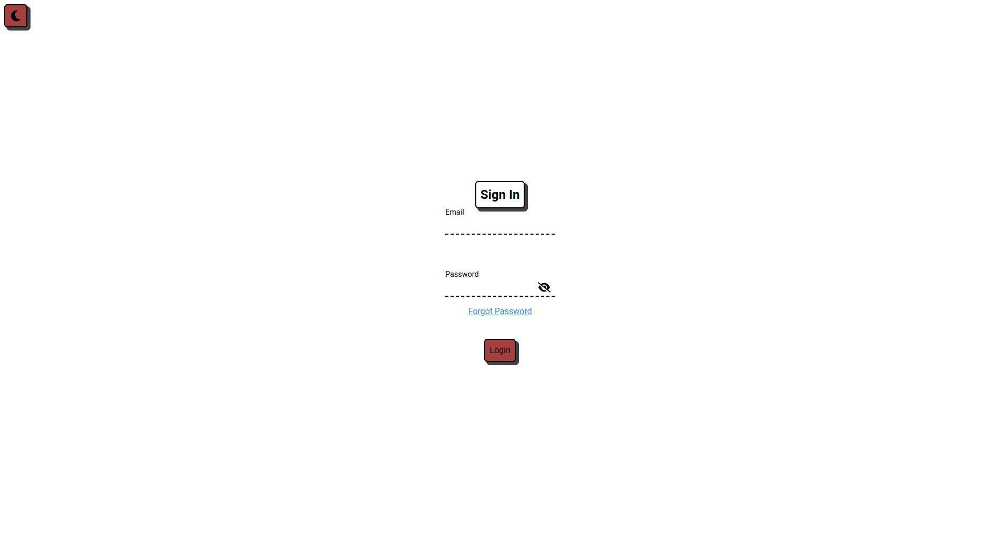
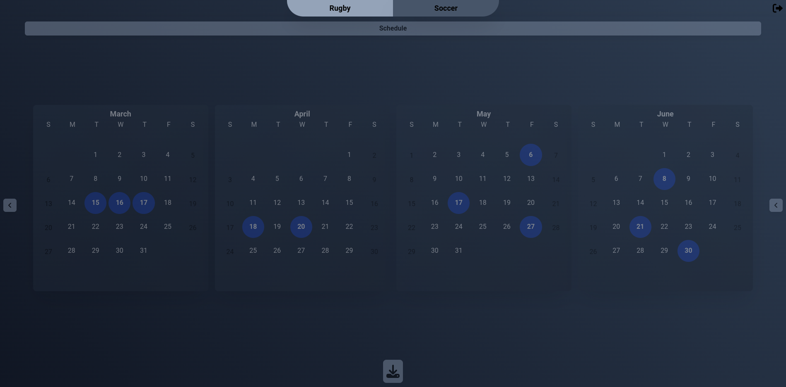
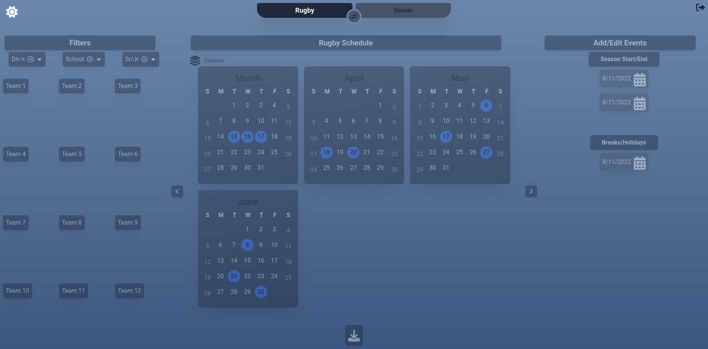
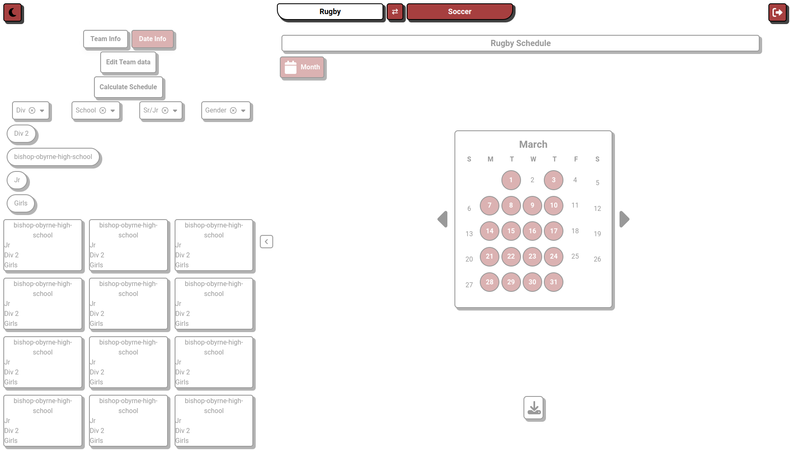

# Welcome to🏉📚[Rugby/Soccer Field Booker](https://fieldbooker.vercel.app)

# Cant do it in time
-   Remove teams in edit feature
-   Global Spring Breaks

    -   Enter school as CSSD or CBE
        -   They can play each other but they have different spring breaks
-   Put Rugby and soccer schedules in the database

    -   Soccer teams are boys only (Sr,Jr div 1,2 and 3)

-   Rugby/Soccer
    -   Separate teams same menu for entering schools

# ToDo list

-   If a school has no field and no alt field they can only play on other teams fields aka away games only

-   Input for information for cru and irish

    -   Cru
        -   Monday - Friday
        -   Fields 1 - 5
        -   User inputs time per field/day
    -   Irish
        -   Monday - Friday
        -   Fields 1 - 2
        -   User inputs time per field/day

# Finished Todos

-   Filter by field
    -   Double
    -   Single
    -   None

    -   Alt (If alt is selected show the below)
        -   Cru
        -   Irish

-   Add accounts soccer and rugby board members
-   Add validation to edit feature
-   Add option for a school to have no field
-   Better responsiveness on small screens (not phones)
-   Add more info to click dialog
    -   Seniority
    -   Div
-   Rugby/Soccer
    -   Separate schedules
-   Move calculations for servers side
-   Expose number of refs input to user
-   Finish edit feature
-   Optimistic updates for adding and editing school

### Needs clarification

-   Input for alt field but not cru or irish?

### Less Important

-   More Field info
    -   Time and date available for div 1 and all other divs
-   Reschedule n dates prior eg. last 3 weeks
-   Add status bottom right with info about the calculation

    -   Did ever team play 6 games (Green/Red)
    -   Number of games calculated / Theoretical max for everyone playing 6 games

-   Add List view
-   Fix compare view
-   Finish day/week view
-   Games already happened
-   Better loading state in login menu

#### Even Less Important

-   Migrate to next.js 13 app directory
-   Forgot password template email

#### Extra Info

-   Season start/end per school
-   Breaks cbe catholic or both
-   Edit teams bulk edit
-   Black out days
-   Min 4 teams per div
-   Rainout re-render
-   Reschedule all games after rainout week but not any before
