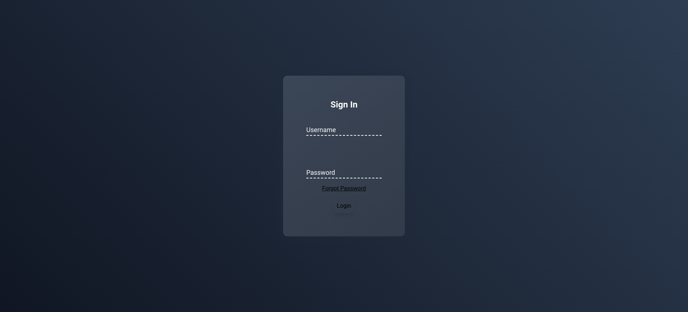
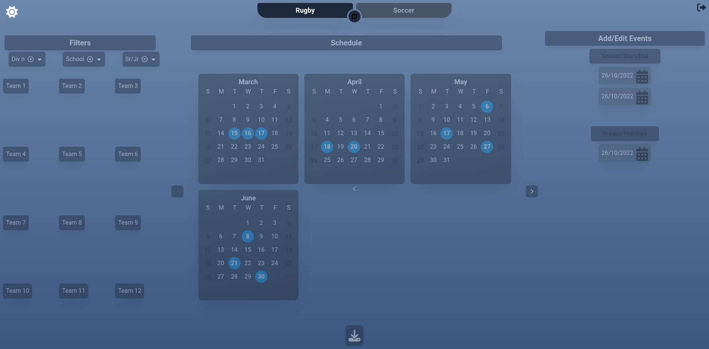
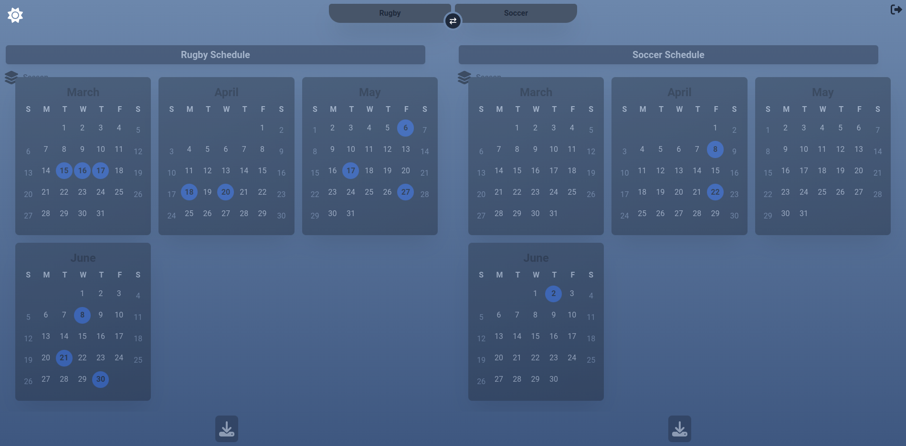

# Welcome to🏉📚[Rugby/Soccer Field Booker](https://fieldbooker.netlify.app)

# ToDo list
- Persist login auth
- Persist dark mode

- fix filter chip overlay issue
- Cal section full screen
- Cal multiple views (day, week, month, season, ext.)

- indicate selected
- show valid teams
- team colors
- Forgot password modal popup
- Forgot password template email
- Custom node js login (no firebase #slow af)
- FireBase DataBase (store schedule)
- games already happened
- calendar event hover effect
- Admin pane 
- Date picker (events pane)
- school and division specific events 
- add teams 
- compare soccer and rugby schedules

- Convert as much as possible to astro to remove maximum js
- Use nanostores instead of react context